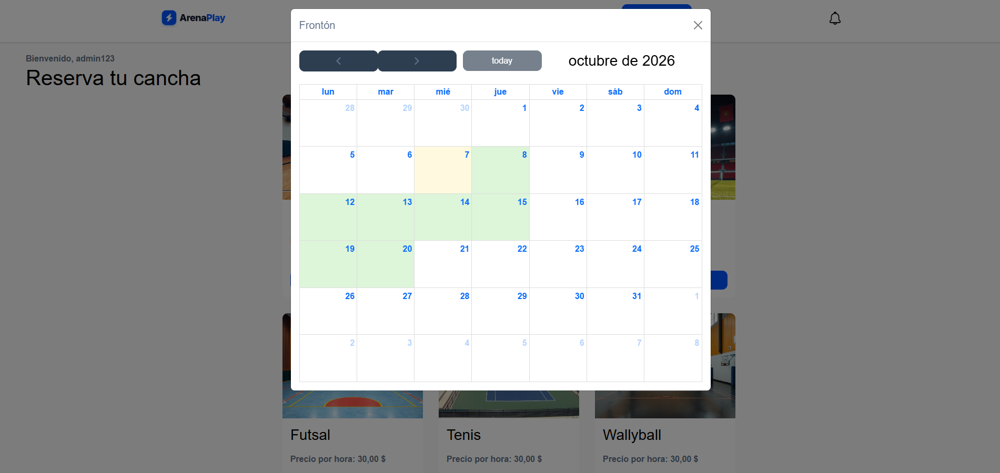
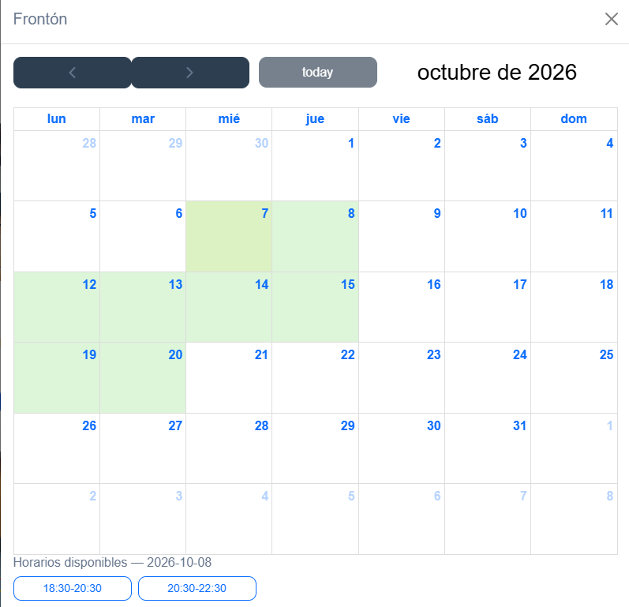
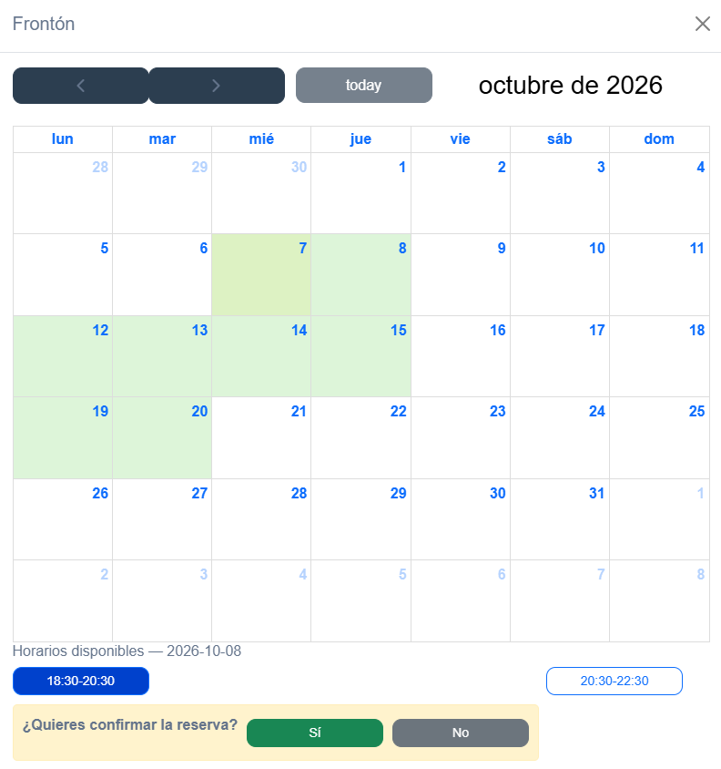
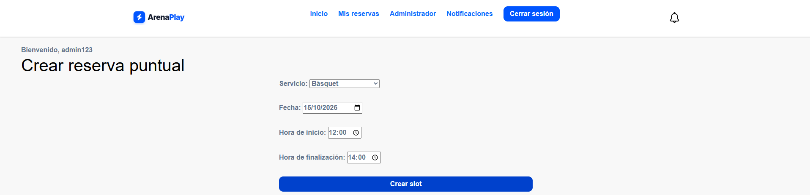
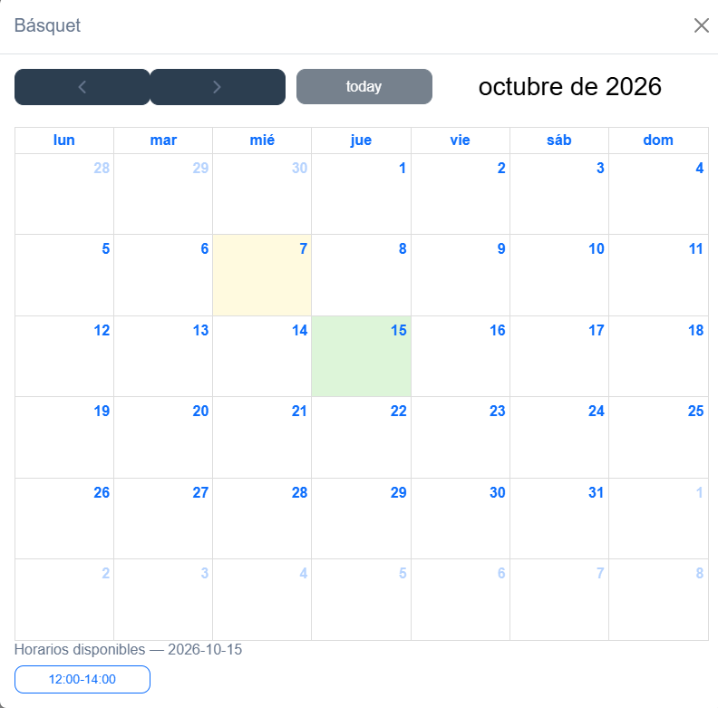
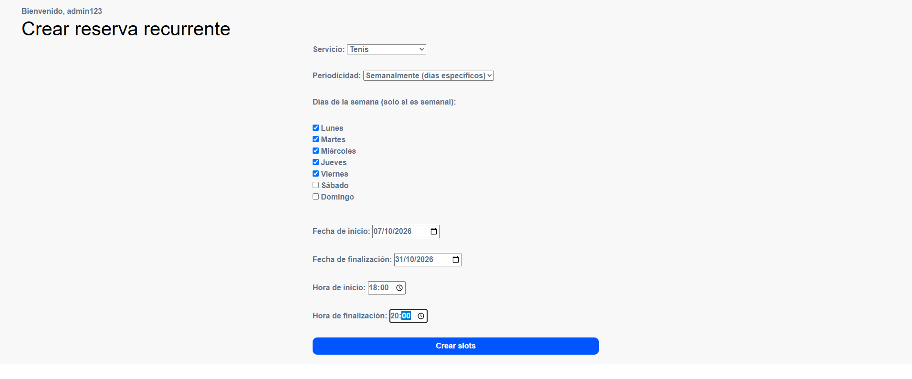
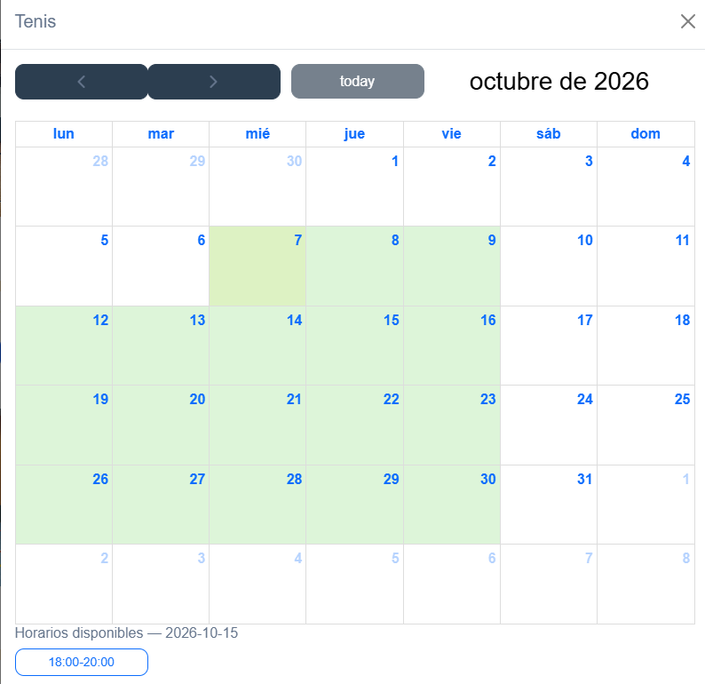

# Sistema de Reservas de Canchas

Documentación de uso del sistema para **usuarios** y **administradores**.
Incluye cómo tomar una reserva y cómo el administrador crea reservas individuales y recurrentes.

---

## Tabla de contenidos

- [Sistema de Reservas de Canchas](#sistema-de-reservas-de-canchas)
  - [Tabla de contenidos](#tabla-de-contenidos)
  - [Cómo tomar una reserva](#cómo-tomar-una-reserva)
    - [Pasos](#pasos)
    - [Crear reserva individual](#crear-reserva-individual)
      - [Pasos](#pasos-1)
  - 
    - [Crear reserva recurrente](#crear-reserva-recurrente)
      - [Pasos](#pasos-2)
  - [Últimas consideraciones](#últimas-consideraciones)
---

## Cómo tomar una reserva

Flujo para que un **usuario registrado** reserve una cancha.

### Pasos

1. Inicia sesión con tu cuenta.
2. En la pagina de entrada estan las diferentes opciones de canchas pra verificar las reservas disponibles en cada una. haz click en **Ver calendario** para abrir el calendario de reservas. 
3. En el calendario, las fechas con reservas disponibles estaán de color verde, las que no, de color blanco. Ejmeplo:

4. Selecciona un dia disponible para que, abajo del calendario, aparezcan los horarios disponibles de ese dia. 
Ejemplo:

5. Luego se selecciona uno de los horarios, entonces, sale abajo la opcion de hacer reserva. Hay que pulsar que "Si" para hacer la reserva. 
Ejemplo:

Entonces, si clickamos a la pestaña de **Mis reservas**, aparecerá la reserva que acabamos de hacer. 

---

### Crear reserva individual

Reserva para **una sola fecha y horario**, sin repetición.

#### Pasos

1. Entra a la pestaña de administración. Esta solo aparece si eres un administrador o super user. En **/login/** y **/register/**  salen las credenciales de super user.
2. Click en **Crear reserva puntual**.
3. Completa los campos:
   - **Servicio**
   - **Fecha**
   - **Hora inicio** / **Hora fin**
4. Guarda.
Ejemplo:

Ahora, si vamos a **Inicio** y entramos al servicio (en el ejemplo Basquet), podemos entrar y ver la reserva que acabamos de crear.

Ejemplo:

---

### Crear reserva recurrente

Reserva que se repite en varios días u horarios según una regla. 

#### Pasos

1. Entra a la pestaña de administración. Esta solo aparece si eres un administrador o super user. En **/login/** y **/register/**  salen las credenciales de super user.
2. Click en **Crear reserva recurrente**.
3. Completa los campos:
   - **Servicio**
   - **Periodicidad**
   - **Dias de la semana (solo si se ecoge periodicidad semanal)**
   - **Fecha de inicio**
   - **Fecha de finalización**
   - **Hora de inicio** / **Hora de finalización**
4. Click en **Guardar slots**.
Ejemplo:

Ahora, si vamos a **Inicio** y entramos al servicio (en el ejemplo Tenis), podemos entrar y ver las reservas que acabamos de crear.

Ejemplo:

Se pueden crear reservas recurrentes de forma diaria y semanal. de forma diaria se crean reservas todos los dias 
que estan entre **Fecha de inicio** y **Fecha de finalización**. De forma semanal se reservan solo los dias escogidos en **Dias de la semana** entre **Fecha de inicio** y **Fecha de finalización**.

## Últimas consideraciones
Cada vez que Render se redespliega después de dormir (15 min sin tráfico), el disco se reconstruye desde cero. El db.sqlite3 que tenía las reservas que se hicieron se elimina y empieza en blanco. La solución para esto es usar una base de datos persistente, pero, para este ejercicio, preferí no usarlo para no sobre complicar el proyecto y evitar usar un servicio que tenga solo unos cuantos dias de servicio gratuito y luego se elimine la base de datos igualmente.